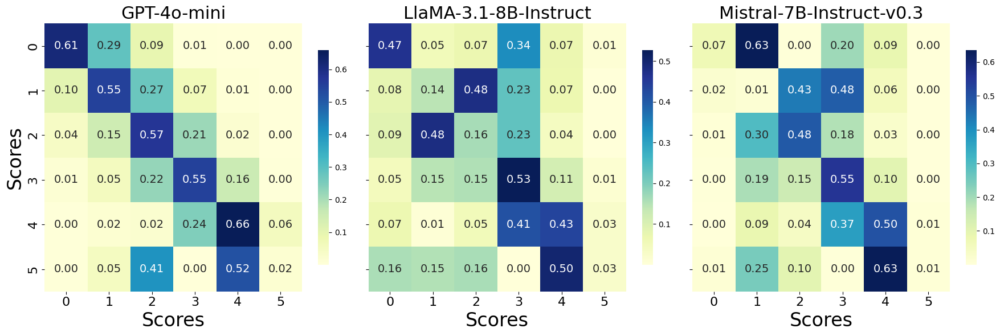

# DS2: Improving Data Efficiency via Curating LLM-Driven Rating Systems


<a href='https://github.com/UCSC-REAL/DS2'></a>
<a href='https://arxiv.org/abs/2410.10877'></a> 

[Jinlong Pang](https://jlpang863.github.io/), [Jiaheng Wei](https://sites.google.com/ucsc.edu/jiahengwei), [Ankit Parag Shah](https://ankitshah009.github.io/), [Zhaowei Zhu](https://users.soe.ucsc.edu/~zhaoweizhu/),  [Yaxuan Wang](https://supergirl-os.github.io/), [Chen Qian](https://users.soe.ucsc.edu/~qian/), [Yang Liu](http://www.yliuu.com/), [Yujia Bao](https://www.yujia.io/) and [Wei Wei](http://www.weiwei.one/).

**[REAL Lab](https://github.com/UCSC-REAL), University of California, Santa Cruz**


------ 

## 🎉🎉 News 
- [x] [2025.03.13] 🔥🔥 Release LLM generated raw scores (GPT-4o-mini, LLM-3.1-8b-inst, Mistral-7b-v0.3-inst) for [TULU_300k](https://huggingface.co/datasets/jlpang888/tulu_300k) in Huggingface!
- [x] [2025.01.22] 👏👏 Accepted by **ICLR 2025**.
- [x] [2024.11.10] 📢📢 Release the [curated dataset](https://huggingface.co/datasets/jlpang888/cured_dataset_gpt_4o_mini) in Huggingface.
- [x] [2024.10.08] 🚀🚀 Release the code of **DS2**.

## Brief Introduction
This project is motivated by the frequent and widespread errors in LLM-generated raw rating scores, which can vary significantly across different models.
The score errors can be visualized by a score transition matrix (A larger value on the matrix’s diagonal indicates that the score error is smaller)




In response, we introduce **DS2**, a diversity-aware score curation approach to enhance data selection.


- **Prompt-based LLM Rating**: We generate an initial quality score for each data sample using advanced LLMs.
- **Curated Quality Score Generation**: This step corrects potential rating score errors from the previous step by leveraging the Score Transition Matrix to derive a curated quality score.
- **Long-tail Diversity Score Generation**: We score the diversity of each example by measuring the distance between feature embeddings, identifying samples that fall outside common clusters, which tend to be more distinct.
- **Final Data Selection**:  We prioritize data by first sorting based on the curated scores and then by the long-tail scores. This dual sorting strategy helps with removing poor-quality outliers while ensuring a diverse, high-quality dataset.

------ 


## Dataset preparation

One can download the evaluation/training data by

```bash
# eval data
bash model_finetune/prepare_eval_data.sh

# train data
bash model_finetune/prepare_train_data.sh
```


----- 
## 🚀🚀 Quick Start

### 🧩 Step 1. LLM-prompt-based rating

In this project, we use three labeling models to generate rating scores, including GPT-4o-mini, Mistral-7B-Instruct-v0.3, LLaMA-3.1-8B-Instruct.  One can obtain the LLM-generated rating scores by: 
```bash
#Open-source LLMs
cd LLM_scoring && bash scoring.sh

# Api call
cd LLM_scoring && bash scoring_api.sh
```

By default, we compress rating scores into six categories `[0,1,2,3,4,5]`, although adjustments can be made to suit specific requirements if necessary. Please ensure to update the corresponding value in `score_curation/tulu_template.py` and `subset_generation.py` if any changes are made.

---

### 🧩 Step 2. Score curation
One can execute the score curation by running
```
cd score_curation && bash diagnose.sh
```
The corresponding curation report files can be found in the path `score_curation_results/`.


---

### 🧩 Step 3. Data selection
Given the generated score curation reports, one can directly generate the high-quality subset by 
```
python subset_generation.py
``` 
The generated subsets can be further used for the following LLM instruction tuning.


---
### 🧩 Step 4. Finetune & Evaluation
The generated subsets in the `selected_data` path can be used for LLM instruction tuning.  Here, for easily reproduction, one can directly finetune the models by (Codebase: [TULU](https://github.com/allenai/open-instruct))
```
cd model_finetune && bash run_pipeline.sh
```


------

## Citation
If you used this repository, please cite our work:
```
@article{pang2024improving,
  title={Improving Data Efficiency via Curating LLM-Driven Rating Systems},
  author={Pang, Jinlong and Wei, Jiaheng and Shah, Ankit Parag and Zhu, Zhaowei and Wang, Yaxuan and Qian, Chen and Liu, Yang and Bao, Yujia and Wei, Wei},
  journal={International Conference on Learning Representations},
  year={2025}
}
```