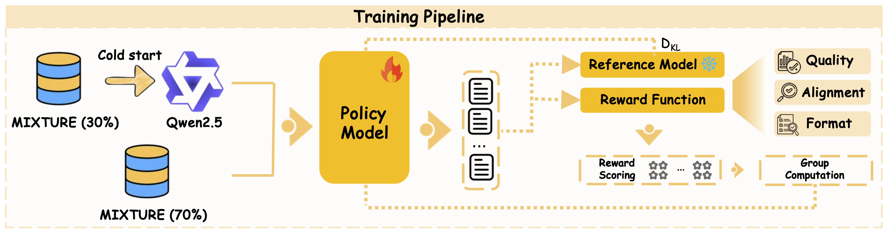

<div align=center>
</div> 
<h2 align="center">
<a href="">LM-mixup: Text Data Augmentation via Language Model based Mixup
</a></h2>

## Abstract
Instruction tuning is crucial for aligning Large Language Models (LLMs), yet the quality of instruction-following data varies significantly. While high-quality data is paramount, it is often scarce; conversely, abundant low-quality data is frequently discarded, leading to substantial information loss. Existing data augmentation methods struggle to augment this low-quality data effectively, and the evaluation of such techniques remains poorly defined. To address this, we formally define the task of *Instruction Distillation*: distilling multiple low-quality and redundant inputs into high-quality and coherent instruction-output pairs. Specifically, we introduce a comprehensive data construction pipeline to create **MIXTURE**, a 144K-sample dataset pairing low-quality or semantically redundant imperfect instruction clusters with their high-quality distillations. We then introduce *LM-Mixup*, by first performing supervised fine-tuning on **MIXTURE** and then optimizing it with reinforcement learning. This process uses three complementary reward signals: quality, semantic alignment, and format compliance, via Group Relative Policy Optimization (GRPO). We demonstrate that *LM-Mixup* effectively augments imperfect datasets: fine-tuning LLMs on its distilled data, which accounts for only about 3% of the entire dataset, not only surpasses full-dataset training but also competes with state-of-the-art high-quality data selection methods across multiple benchmarks. Our work establishes that low-quality data is a valuable resource when properly distilled and augmented with *LM-Mixup*, significantly enhancing the efficiency and performance of instruction-tuned LLMs.


## Brief intro

**Our contributions are summarized as follows:**

- **Task definition:** We introduce **Instruction Distillation**, a task that transforms sparse, incomplete, and low-quality inputs into an information-dense output. To support this, we build **MIXTURE**, a **144K-instance Wikipedia-based dataset** mapping multiple low-quality variants to high-quality targets.  

- **LM-mixup:** We propose **LM-mixup**, initialized with cold-start pretraining and optimized via **GRPO-based reinforcement learning** using **multi-dimensional rewards** (quality, semantic alignment, format compliance), achieving **superior results on MIXTURE** over SFT and strong baselines.  

- **Empirical findings:** Training on distilled data combined with original high-quality data—only **≈3% of the full dataset**—**matches or surpasses full-dataset training** and advanced data selection methods, proving the **value of low-quality data after distillation**.  




## 🎉 News
- [ ] 📦 Release *LM-mixup* checkpoints.
- [x] 📢 Release [**MIXTURE**](https://huggingface.co/datasets/dokiik/MIXTURE) dataset.
- [x] 🚀 Release code of **LM-mixup**.

## 🤖 Install 
1. Install the package
```
conda create -n lm-mixup python=3.9 -y
conda activate lm-mixup
pip install --upgrade pip
pip install -r requirements.txt
```
2. Install additional packages.
```
pip install -e ".[train]"
pip install flash-attn --no-build-isolation
```
3. Install the and MIXTURE dataset.
```
bash prepare_training_data.sh
```
4. Download the embedding library for bayes rating ([lm_mixup_emb_lib.zip](https://drive.google.com/file/d/1VY5dOZ_nWhrkIoPfoH1fLrAaAKhYt3CX/view?usp=sharing)) and unzip it directly under the project root directory (LM-mixup/).
5. Download eval data for OpenLLM benchmark.
```
cd DS2
bash model_finetune/prepare_eval_data.sh
```
## ⚙️ Training Pipeline

Before running GRPO training, we first perform a **Cold Start** stage.

```bash
cd sft
```

Then, we conduct **Supervised Fine-Tuning (SFT)** using `i_t_resume.py`:

```bash
python i_t_resume.py \
  --json_path data/merged_all_30.json \
  --model_name_or_path Qwen/Qwen2.5-1.5B-Instruct \
  --output_dir sft_output/qwen_2_5_1_5b_cold_start \
  --trust_remote_code true \
  --resume_from auto \
  --save_strategy steps --save_steps 1000
```

After obtaining the SFT checkpoint, proceed to **GRPO training**:

```bash
cd EasyR1
bash examples/qwen_2_5_1_5b_mixup_grpo.sh
```

Finally, **merge the trained checkpoint** into the Hugging Face format for deployment or further use:

```bash
python3 scripts/model_merger.py --local_dir checkpoints/easy_r1/exp_name/global_step_1/actor
```

## ⚙️ Evaluation

### Evaluation on MXITURE

First, navigate to the `sft` directory:
```bash
cd sft
```

Run inference with the trained model:
```bash
python batch_infer_split.py \
  --model_path EasyR1/checkpoints/easy_r1/qwen_mixup_1_5b_grpo/global_step_575/actor/huggingface \
  --test_json  /root/autodl-tmp/EasyR1/sft/data \
  --out_dir    infer_out/qwe_1_5_grpo \
  --out_prefix qwe_1_5_grpo_ \
  --batch_size 128 \
  --max_input_tokens 2400 \
  --max_new_tokens 1200 \
  --do_sample false \
  --trust_remote_code true \
  --flush_every 10
```

Next, perform GPT-based evaluation:
```bash
python merged_gen_out_rating.py \
  --input_dir infer_out/qwe_1_5b_grpo \
  --output_dir rating \
  --api_key sk-xxxxxxx \
  --url https://api.openai.com/v1/chat/completions \
  --model gpt-4o-mini \
  --max_workers 128
```

### Evaluation on OpenLLM Benchmark

To evaluate on the **OpenLLM Benchmark**, use the fine-tuned LM-Mixup model for inference.  
For easier reproduction, we provide a ready-to-run evaluation script located at `DS2/model_finetune/train_json`.

Simply run:
```bash
cd DS2/model_finetune
bash train_eval.sh
```

This will automatically execute the evaluation pipeline for OpenLLM Benchmark.


<details>
<summary>💡 Click to expand the full data processing and reproduction pipeline</summary>

---

### **Complete Reproduction Pipeline**

#### **1. Data Preparation**
Navigate to the data processing directory:
```bash
cd data_process
```
Download the full [**data pool**](https://huggingface.co/datasets/jlpang888/tulu_300k) and perform GPT-based quality scoring:
```bash
python gpt_rating.py
```
Alternatively, you can use our pre-rated dataset provided [here](https://drive.google.com/file/d/1h_WbnlmNOWUeKiW1mjFiKev70cLMwzyX/view?usp=share_link), and place it under data_process/data/ in the project root.
```
LM-mixup/
 ├── data_process/
 │   ├── data
```
Samples with GPT scores (1–5 scale) **≥ 4** are labeled as *high-quality*, while those **< 4** are *low-quality*.  The data is further divided into multiple subsets based on their source.

---

#### **2. Clustering Low-Quality Data**
Perform clustering on low-quality subsets.  You can control cluster sizes via the parameters `min_size`, `max_size`, `mean_cap`, and `std_cap`.  

Below is an example for the **dolly_15k** dataset:
```bash
python cluster.py \
  --input data/low_by_dataset/dolly_low.jsonl \
  --output_jsonl tmp_merged/dolly_low.jsonl \
  --model_path BAAI/bge-m3 \
  --device cuda --batch_size 128 \
  --min_size 2 --max_size 5 --mean_cap 3 --std_cap 1 
```

---

#### **3. Converting Clusters to Inference Format**
```bash
python cluter2input.py \
  --input tmp_merged/dolly_low.jsonl \
  --output infer_in/dolly_low.jsonl \
  --sep "\n\n"
```

---

#### **4. Model Inference**
Run inference using the LM-Mixup model:
```bash
python inference.py \
    --model_path EasyR1/checkpoints/easy_r1/qwen_mixup_1_5b_grpo/global_step_575/actor/huggingface \
    --test_json  infer_in/dolly_low.jsonl \
    --out_jsonl   infer_out/dolly.jsonl \
    --batch_size 128 \
    --max_input_tokens 2400 \
    --max_new_tokens 2400 \
    --do_sample false \
    --trust_remote_code true
```

---

#### **5. GPT Rating for Generated Outputs**
```bash
python gpt_rating.py \
    --input_jsonl infer_out/dolly.jsonl \
    --output_dir infer_out/rating
```

---

#### **6. Filtering High-Quality Samples**
```bash
python filter_high.py \
    --input infer_out/rating/scored_dolly.jsonl \
    --output infer_out/dolly_highqual.jsonl \
```

---

#### **7. Long-Tail Scoring**
Compute long-tail diversity scores for the data pool:
```bash
python long_tail_filtering.py \
  --input infer_out/inference_highqual.jsonl \
  --output final_json/inference_highqual_longtail.jsonl \
  --model BAAI/bge-m3 \
  --batch_size 32 \
  --knn_k 15

python long_tail_filtering.py \
  --input data/scored_high.jsonl \
  --output final_json/ori_highqual_longtail.jsonl \
  --model BAAI/bge-m3 \
  --batch_size 32 \
  --knn_k 15
```

---

#### **8. Merging Original and Mixup High-Quality Data**
Finally, merge the original and mixup high-quality datasets in the desired ratio:
```bash
python merge_mixup_with_original.py \
  --original final_json/ori_highqual_longtail.jsonl \
  --mixup final_json/inference_highqual_longtail.jsonl \
  --out final_json/mixup5_ori5_1_5b_10k.jsonl \
  --top-n 5000 \
  --seed 42
```

---

</details>

## Acknowledgement
We are highly inspired by: [DS2](https://github.com/UCSC-REAL/DS2) and [EasyR1](https://github.com/hiyouga/EasyR1/tree/main).

